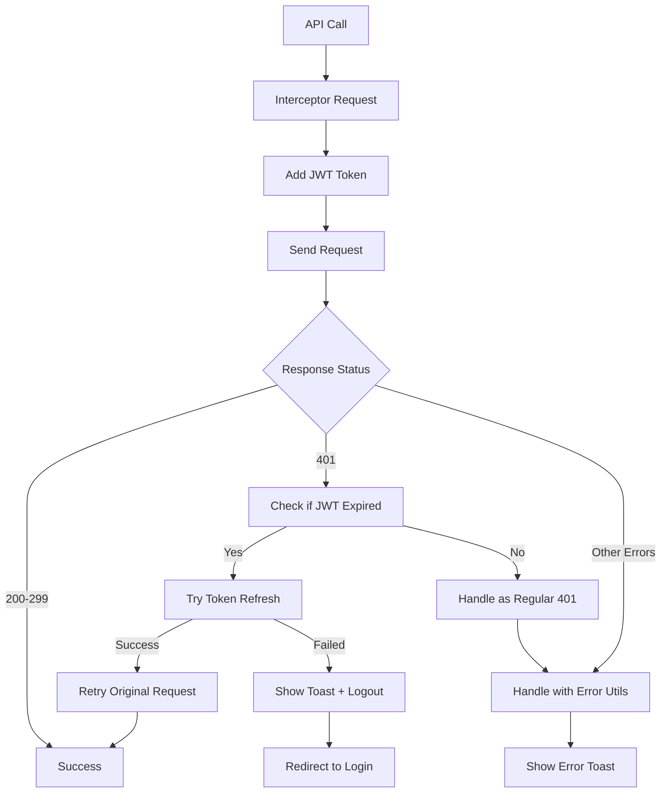

# Sistema de Manejo de Errores JWT - AquaControl

## Descripción General

Este sistema proporciona un manejo automático y robusto de errores de JWT expirado en toda la aplicación, eliminando la necesidad de manejar manualmente estos errores en cada API call.

### 🚀 **Característica Principal: Redirección Automática**

Cuando el JWT expira, el sistema automáticamente:
1. **Detecta** el error 401 por token expirado
2. **Muestra** un toast informativo al usuario
3. **Espera** 2 segundos para que el usuario vea el mensaje
4. **Redirige** automáticamente a `/auth/login`
5. **Limpia** la sesión de NextAuth

> ✅ **Configurado para redirigir a `/auth/login`** como solicitaste.

## Componentes del Sistema

### 1. Interceptor de Axios (`src/lib/axios/interceptors.ts`)

**Funcionalidades:**
- Agrega automáticamente el token JWT a todas las peticiones
- Detecta errores 401 por token expirado
- Maneja la renovación automática de tokens
- Implementa cola de peticiones para evitar múltiples llamadas de logout
- **🎯 Redirige automáticamente a `/auth/login` cuando el token expira**
- Muestra toast informativo antes de la redirección
- Limpia completamente la sesión de NextAuth

**Características técnicas:**
- Interceptor de request: Agrega `Authorization: Bearer {token}` automáticamente
- Interceptor de response: Maneja errores 401 y renovación de tokens
- Sistema de cola para peticiones fallidas durante renovación
- Timeout configurable (10 segundos por defecto)

### 2. Wrapper de APIs (`src/lib/api/apiWrapper.ts`)

**Funciones disponibles:**
```typescript
// GET requests
apiGet<T>(url: string, options?: ApiCallOptions): Promise<T>

// POST requests  
apiPost<T, D>(url: string, data?: D, options?: ApiCallOptions): Promise<T>

// PUT requests
apiPut<T, D>(url: string, data?: D, options?: ApiCallOptions): Promise<T>

// DELETE requests
apiDelete<T>(url: string, options?: ApiCallOptions): Promise<T>

// PATCH requests
apiPatch<T, D>(url: string, data?: D, options?: ApiCallOptions): Promise<T>

// Construir URLs con parámetros
buildUrl(baseUrl: string, params?: Record<string, string | number | boolean>): string
```

**Opciones disponibles:**
```typescript
interface ApiCallOptions {
  showErrorToast?: boolean;        // Mostrar toast de error (default: true)
  customErrorMessage?: string;     // Mensaje personalizado de error
  skipJWTHandling?: boolean;       // Saltar manejo automático de JWT (default: false)
}
```

### 3. Utilidades de Error (`src/lib/utils/errors.ts`)

**Funciones principales:**
```typescript
// Manejo general de errores
handleErrors(error: unknown, options?: ErrorOptions): ErrorHandlingResult

// Manejo específico de errores JWT
handleJWTError(error: AxiosError): Promise<ErrorHandlingResult>

// Detectar errores JWT
isJWTExpiredError(error: AxiosError): boolean

// Para hooks con SWR
handleSWRError(error: unknown): void
```

**Tipos de error detectados:**
- `JWT_EXPIRED`: Token expirado
- `UNAUTHORIZED`: No autorizado
- `VALIDATION`: Errores de validación (400, 422)
- `SERVER_ERROR`: Errores del servidor (5xx)
- `NETWORK_ERROR`: Errores de conexión
- `UNKNOWN`: Errores desconocidos

### 4. Hook de Autenticación (`src/hooks/useAuthError.ts`)

**Funcionalidades:**
```typescript
const {
  handleAuthError,     // Manejar errores de autenticación
  isAuthenticated,     // Estado de autenticación
  getValidToken,       // Obtener token válido
  session,            // Sesión actual
  status              // Estado de la sesión
} = useAuthError();
```

## Implementación en APIs

### Antes (Método Antiguo)
```typescript
// user.api.ts - ANTES
import axios from 'axios';

export const userApi = {
  getUsers: async (accessToken: string): Promise<ResponseUser> => {
    const response = await axios.get(`${API_URL}/users/traer-usuarios`, {
      headers: { Authorization: `Bearer ${accessToken}` }
    });
    return response.data;
  }
};
```

### Después (Método Nuevo)
```typescript
// user.api.ts - DESPUÉS
import { apiGet } from '@/lib/api/apiWrapper';

export const userApi = {
  getUsers: async (): Promise<ResponseUser> => {
    return await apiGet<ResponseUser>('/users/traer-usuarios');
  }
};
```

### Ejemplo Completo de API Actualizada
```typescript
// product.api.ts
import { Product, ResponseProduct, ResponseProductById } from '@/types/product';
import { apiGet, apiPost, apiPut, apiDelete, buildUrl } from '@/lib/api/apiWrapper';

export const productApi = {
  // GET con filtros
  getProducts: async (filters: Record<string, any> = {}): Promise<ResponseProduct> => {
    const url = buildUrl('/productos/traer-productos', filters);
    return await apiGet<ResponseProduct>(url);
  },

  // GET con paginación
  getProductsByPagination: async (
    page: number, 
    limit: number, 
    filters: Record<string, any> = {}
  ): Promise<ResponseProduct> => {
    const url = buildUrl('/productos/traer-productos-con-paginacion', {
      page,
      limit,
      ...filters
    });
    return await apiGet<ResponseProduct>(url);
  },

  // GET por ID
  getProductById: async (productId: number): Promise<ResponseProductById> => {
    return await apiGet<ResponseProductById>(`/productos/traer-producto/${productId}`);
  },

  // POST - Crear
  createProduct: async (productData: Omit<Product, 'id'>): Promise<ResponseProductById> => {
    return await apiPost<ResponseProductById, Omit<Product, 'id'>>(
      '/productos/crear-producto', 
      productData
    );
  },

  // PUT - Actualizar
  updateProduct: async (
    productId: number, 
    productData: Partial<Product>
  ): Promise<ResponseProductById> => {
    return await apiPut<ResponseProductById, Partial<Product>>(
      `/productos/editar-producto/${productId}`, 
      productData
    );
  },

  // DELETE - Eliminar
  deleteProduct: async (productId: number): Promise<ResponseProductById> => {
    return await apiDelete<ResponseProductById>(`/productos/eliminar-producto/${productId}`);
  }
};
```

## Implementación en Hooks

### Antes (Con manejo manual de errores)
```typescript
// useUserList.ts - ANTES
const { data, error, isLoading, mutate } = useSWR(
  key,
  async ([, token, page, limit, filters]) => {
    const data = await userApi.getUsersWithPagination(token, page, limit, filters);
    return data.data;
  }
);

// Manejo manual de errores
useEffect(() => {
  if (error) {
    handleErrors(error);
  }
}, [error]);
```

### Después (Con manejo automático)
```typescript
// useUserList.ts - DESPUÉS
import { handleSWRError } from '@/lib/utils/errors';

const { data, error, isLoading, mutate } = useSWR(
  key,
  async ([, page, limit, filters]) => {
    const data = await userApi.getUsersWithPagination(page, limit, filters);
    return data.data;
  },
  {
    onError: handleSWRError,  // Manejo automático de errores
    // otras opciones...
  }
);
```

## Casos de Uso Especiales

### 1. Deshabilitar manejo automático de JWT
```typescript
const data = await apiGet('/some-endpoint', {
  skipJWTHandling: true
});
```

### 2. Mensaje de error personalizado
```typescript
const data = await apiPost('/create-user', userData, {
  customErrorMessage: 'Error al crear usuario'
});
```

### 3. Deshabilitar toast de error
```typescript
const data = await apiGet('/silent-endpoint', {
  showErrorToast: false
});
```

### 4. Manejo manual en componentes
```typescript
import { useAuthError } from '@/hooks/useAuthError';

const MyComponent = () => {
  const { handleAuthError, isAuthenticated } = useAuthError();

  const handleCustomError = async (error: unknown) => {
    const result = await handleAuthError(error, {
      customErrorMessage: 'Error personalizado',
      redirectToLogin: false
    });

    if (result.isTokenExpired) {
      // Lógica específica para token expirado
    }
  };
};
```

## Flujo de Manejo de Errores



## Beneficios del Sistema

1. **Manejo Automático**: No necesitas manejar manualmente errores JWT en cada API call
2. **Consistencia**: Comportamiento uniforme en toda la aplicación
3. **Experiencia de Usuario**: Mensajes claros y redirección automática
4. **Mantenibilidad**: Código más limpio y fácil de mantener
5. **Flexibilidad**: Opciones para casos especiales
6. **Tipos Seguros**: Full TypeScript support con tipos estrictos

## Migración de APIs Existentes

Para migrar una API existente:

1. **Remover imports de axios**:
   ```typescript
   // ❌ Remover
   import axios from 'axios';
   const API_URL = process.env.NEXT_PUBLIC_API_URL || 'http://localhost:5000';
   ```

2. **Agregar imports del wrapper**:
   ```typescript
   // ✅ Agregar
   import { apiGet, apiPost, apiPut, apiDelete, buildUrl } from '@/lib/api/apiWrapper';
   ```

3. **Actualizar funciones**:
   ```typescript
   // ❌ Antes
   getUsers: async (accessToken: string): Promise<ResponseUser> => {
     const response = await axios.get(`${API_URL}/users`, {
       headers: { Authorization: `Bearer ${accessToken}` }
     });
     return response.data;
   }

   // ✅ Después
   getUsers: async (): Promise<ResponseUser> => {
     return await apiGet<ResponseUser>('/users');
   }
   ```

4. **Actualizar hooks que usan la API**:
   ```typescript
   // ❌ Antes
   const data = await userApi.getUsers(token);

   // ✅ Después
   const data = await userApi.getUsers();
   ```

## Configuración de Entorno

Asegúrate de que estas variables estén configuradas:

```env
NEXT_PUBLIC_API_URL=http://localhost:5000
NEXTAUTH_URL=http://localhost:3000
NEXTAUTH_SECRET=your-secret-key
```

## Troubleshooting

### Error: "Request failed with status code 401"
- **Causa**: Token expirado o inválido
- **Solución**: El sistema maneja esto automáticamente, pero verifica que NextAuth esté configurado correctamente

### Error: "Network Error"
- **Causa**: Servidor no disponible
- **Solución**: Verifica que `NEXT_PUBLIC_API_URL` esté configurado correctamente

### Error: "Cannot read properties of undefined"
- **Causa**: Respuesta de API no tiene la estructura esperada
- **Solución**: Verifica los tipos TypeScript y la estructura de respuesta del backend

## Próximos Pasos

1. Migrar todas las APIs existentes al nuevo sistema
2. Actualizar todos los hooks para usar `handleSWRError`
3. Implementar tests unitarios para el sistema de errores
4. Documentar casos edge específicos del proyecto
